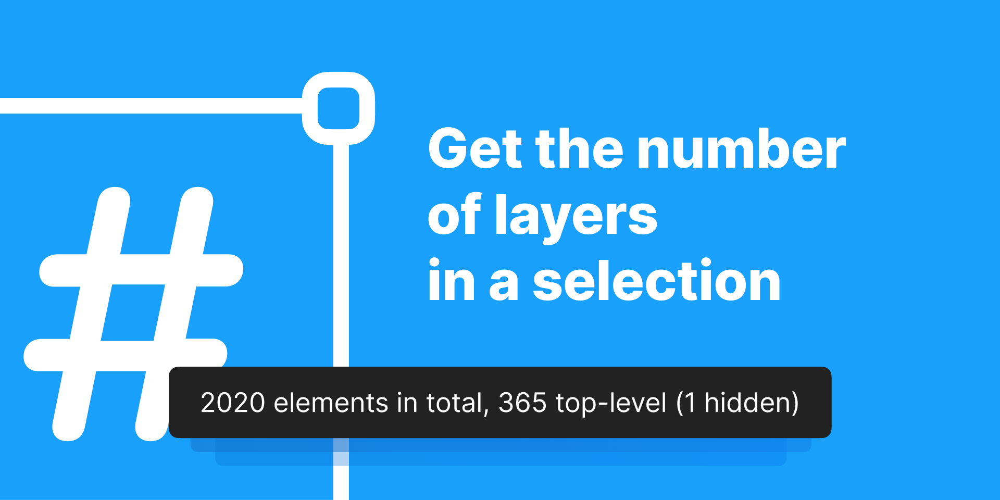

# Layer Counter



This is a simple Figma (and FigJam!) plugin that counts layers in a selection and presents the result in a standard Figma toast at the bottom of the screen. The plugin also specifies how many layers are hidden and how many layers are selected directly (so-called top-level elements).

Another potentially useful feature of this plugin is that it logs to the console how many layers of different kinds are presented in a selection. In practice, it looks something like this (see the `types` property):

```json
{
    "total": 298,
    "hidden": 32,
    "topLevel": 47,
    "types": {
        "RECTANGLE": 71,
        "COMPONENT": 2,
        "TEXT": 50,
        "INSTANCE": 24,
        "GROUP": 21,
        "FRAME": 73,
        "VECTOR": 51,
        "ELLIPSE": 6
    }
}
```

This information is rarely needed but can be useful in some cases.

## Technical Information
The plugin has been written in TypeScript and built with Webpack. (I also have a repository that can be used as a template for creating new plugins, [figma-plugin-boilerplate](https://github.com/gnchrv/figma-plugin-boilerplate)). 
